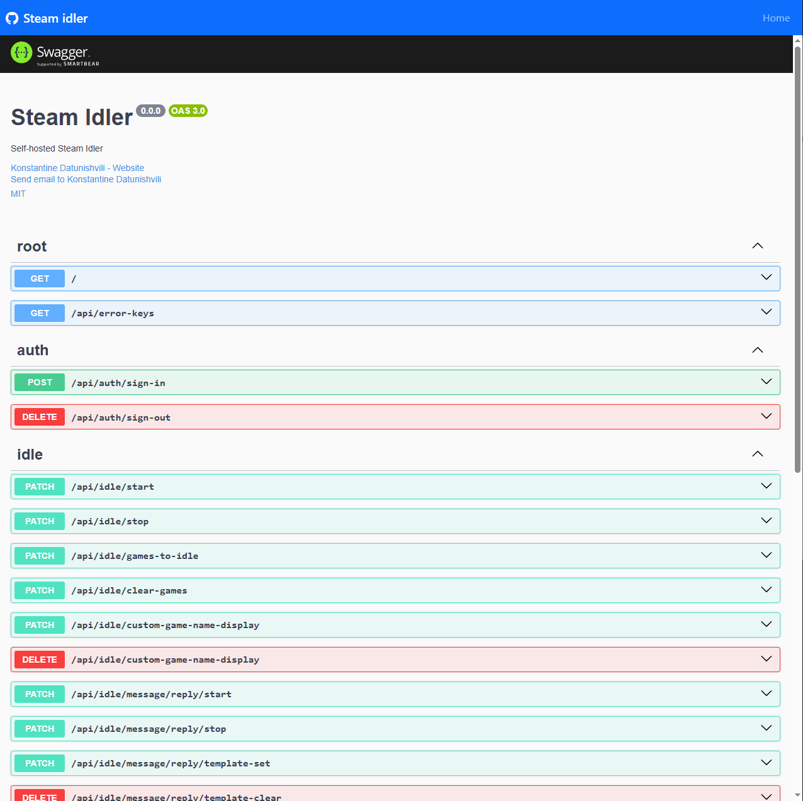

<p align="center">
  
  <br>
  <em>Steam-Idler: open-source idling application.</em>
</p>

<h2>Table of contents</h2>

- [Introduction](#introduction)
- [Features](#features)
- [Getting started](#getting-started)
  - [Prerequisites](#prerequisites)
  - [How to set up](#how-to-set-up)
  - [Docker compose](#docker-compose)
- [How does it work](#how-does-it-work)
- [Development](#development)
- [Usage](#usage)
- [Screenshots](#screenshots)
- [Project Architecture](#project-architecture)
- [Contributing](#contributing)
- [Issues](#issues)
- [Logs](#logs)
- [To Do](#to-do)

## Introduction

Steam-Idler is a self-hosted application for Steam game idling.
It can idle as many games as you want on as many accounts as you want.
It's great for farming cards or increasing game hours.

## Features

- Docker support
- Simple managing UI
- Parallel multi-account idling
- Idling multiple games in parallel
- Managing Steam persona status while idling
- Custom message replies while idling
- Custom game display while idling

## Getting started

See instructions to run Steam-idler below.

### Prerequisites

- [Docker](https://www.docker.com/) - production
- [npm](https://www.npmjs.com/) & [mongodb](https://www.mongodb.com/docs/manual/installation/) - development (local)

### How to set up

The application can be easily set up using Docker Compose.

### Docker compose

```
mkdir steam-idler
cd steam-idler
curl -o docker-compose.yml https://raw.githubusercontent.com/KostaD02/steam-idler/main/docker-compose.yml
```

```
docker compose up -d
```

> [!NOTE]
> That was it, you are ready to use it!

## How does it work

The first question might be: Is it safe?
Yes this application uses the [steam-user](https://www.npmjs.com/package/steam-user) package, which allows interaction with the Steam API through Node.js.

To start idling for an account, you need to sign in first. During this process, you'll be prompted to provide the following information:

- Username
- Password
- Two-factor authentication code

After the authorization process, your data will be saved on your machine using MongoDB. This data does not include your **password**.
The following will be saved after authorization:

- `steamId`
- `steamCookies`
- `steamRefreshToken`

You can review exactly what is stored by checking this [file](https://github.com/KostaD02/steam-idler/blob/main/src/schemas/user.ts).
This data is required to prevent the need to log in again whenever the server is stopped or restarted.

> [!CAUTION]
> Since your password is sent during the sign-in process, it is recommended to use a [reverse proxy](https://en.wikipedia.org/wiki/Reverse_proxy) in your hosted environment.

## Development

First we need to clone repository.

```
git clone https://github.com/KostaD02/steam-idler
```

Then need to install packages:

```
cd steam-idler
npm ci
```

Create `.env` file similar to `.env.example`, for example:

```
PORT = 2222
HIDE_LOGS = false
DATABASE_URL = mongodb://127.0.0.1:27017/steam-idler
```

> [!NOTE]
> You can change the `DATABASE_URL` to a remote address, but be sure to consider security implications.

After that, run the following script in the terminal:

```
npm run start
```

## Usage

Just open the browser and type `ip:port` of the machine running Steam-idler.

## Screenshots

Check more images inside the [screenshots](https://github.com/KostaD02/steam-idler/tree/main/screenshots).




## Project Architecture

The application is built using the [NestJS](https://nestjs.com/).

- Server side:
  - [Nestjs](https://nestjs.com/)
  - [Mongodb](https://www.mongodb.com/)
- Client side:
  - Vanilla html, css, js.
  - [Bootstrap](https://getbootstrap.com/)

## Contributing

I will add new features when I have time, but you don't have to wait feel free to add them yourself! Fork the project and submit [pull requests](https://github.com/KostaD02/steam-idler/pulls).
Check more details at [contributing page](https://github.com/KostaD02/steam-idler/blob/main/CONTRIBUTING.md).

## Issues

If you see any [issues](https://github.com/KostaD02/steam-idler/issues), feel free to open an issue or suggest a [pull request](https://github.com/KostaD02/steam-idler/pulls).

## Logs

If you didn't hide logs from the `.env` file, you can easily check what's happening in background processes by running this script:

```
docker logs steam-idler --follow
```

## To Do

Here are a few ideas that will be implemented in the future.
You can also open an issue for any of these ideas.

- Better client side UI
- i18n - translations for client side
